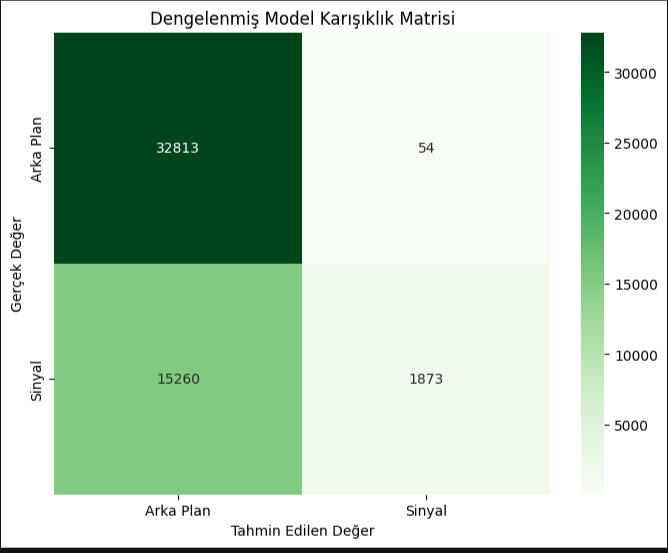
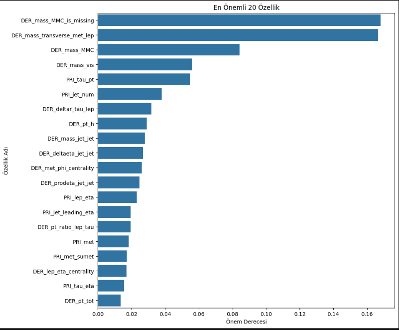

# CERN Parçacık Fiziği Verileriyle Sinyal Tespiti için Makine Öğrenmesi

Bu proje, CERN'deki Büyük Hadron Çarpıştırıcısı'nda (LHC) simüle edilmiş yüksek enerjili parçacık çarpışma verilerini kullanarak, nadir bulunan "sinyal" olaylarını (Higgs bozonu gibi) yaygın "arka plan" olaylarından ayırt etmeyi amaçlayan bir makine öğrenmesi modelini içermektedir.

## Problem Tanımı ve Hikayesi

Yüksek enerji fiziğinin en büyük zorluklarından biri, her saniye gerçekleşen milyarlarca parçacık çarpışması arasından, yeni keşiflere yol açabilecek o değerli birkaç olayı ("sinyal") ayıklamaktır. Bu, adeta bir "samanlıkta iğne arama" problemidir. Bu proje, bu süreci otomatikleştirmek için XGBoost gibi güçlü bir makine öğrenmesi algoritmasını kullanarak, bir çarpışma olayının kinematik özelliklerine dayanarak sinyal mi yoksa arka plan mı olduğunu yüksek doğrulukla tahmin eden bir sınıflandırıcı geliştirir.

## Kullanılan Teknolojiler ve Kütüphaneler
- **Python 3.9+**
- **Veri Analizi ve İşleme:** Pandas, NumPy
- **Makine Öğrenmesi:** Scikit-learn, XGBoost
- **Veri Görselleştirme:** Matplotlib, Seaborn
- **Geliştirme Ortamı:** Jupyter Notebook

## Veri Seti
Bu projede kullanılan veri seti, [Kaggle'daki "Higgs Boson Machine Learning Challenge"](https://www.kaggle.com/c/higgs-boson/data) yarışmasından alınmıştır. Veri seti, 250,000 adet simüle edilmiş çarpışma olayını, her bir olay için 30 farklı kinematik özelliği ve olayın "sinyal" (s) mi yoksa "arka plan" (b) mı olduğunu belirten bir etiketi içerir.

## Proje Yapısı
```
cern-particle-classifier/
├── data/
│   ├── raw/
│   └── processed/
├── notebooks/
│   ├── 01-EDA-Initial-Analysis.ipynb
│   ├── 02-Feature-Engineering-and-Preprocessing.ipynb
│   └── 03-Model-Training-and-Evaluation.ipynb
├── reports/
│   └── figures/
│       ├── confusion_matrix.png
│       └── feature_importance.png
├── .gitignore
├── README.md
└── requirements.txt
```

## Kurulum ve Kullanım

Projeyi kendi bilgisayarınızda çalıştırmak için aşağıdaki adımları izleyebilirsiniz:

```bash
# 1. Depoyu klonlayın
git clone [https://github.com/KULLANICI_ADIN/cern-particle-classifier.git](https://github.com/idrisq/cern-particle-classifier)
cd cern-particle-classifier

# 2. Sanal ortam oluşturun ve aktive edin
# Windows için: python -m venv venv && venv\Scripts\activate
# MacOS/Linux için: python3 -m venv venv && source venv/bin/activate

# 3. Gerekli kütüphaneleri yükleyin
pip install -r requirements.txt

# 4. Analizleri ve model eğitimini incelemek için Jupyter'i başlatın
jupyter notebook
```

## Metodoloji

Proje, aşağıdaki adımları izlemiştir:
1.  **Keşifsel Veri Analizi (EDA):** Veri setinin yapısı incelenmiş, özelliklerin dağılımları sinyal ve arka plan olayları için karşılaştırılmıştır.
2.  **Veri Ön İşleme:** Fiziksel olarak "ölçüm yapılamayan" durumları belirten `-999.0` değerleri, medyan ile doldurulmuş ve bu durumun kendisi de modele bir bilgi olarak sunulmak üzere "gösterge özellikleri" (indicator features) oluşturulmuştur.
3.  **Model Geliştirme:** Sınıf dengesizliği problemini çözmek için `scale_pos_weight` parametresiyle ayarlanmış bir **XGBoost Classifier** modeli kullanılmıştır.
4.  **Değerlendirme:** Modelin performansı, eğitimde görmediği doğrulama seti üzerinde Karışıklık Matrisi (Confusion Matrix) ve Ağırlıklı ROC AUC Skoru gibi metriklerle ölçülmüştür.

## Sonuçlar ve Değerlendirme

İyileştirilmiş modelimiz, doğrulama seti üzerinde **XX.XX% ROC AUC Skoru** elde etmiştir. Karışıklık Matrisi, modelin özellikle sinyal olaylarını yakalama (recall) yeteneğinin, `scale_pos_weight` parametresi sayesinde belirgin şekilde arttığını göstermektedir.


## Özellik Önemliliği Analizi

Modelimizin karar verirken en çok hangi fiziksel değişkenlere güvendiğini anlamak için özellik önemliliği analizi yapılmıştır. Sonuçlar, fiziksel sezgilerle uyumlu olarak, `DER_mass_MMC` (Higgs bozonu kütle tahmini) gibi yüksek seviyeli türetilmiş özelliklerin en ayırt edici bilgiler olduğunu göstermektedir.


## Gelecek Geliştirmeler
- Model performansını daha da artırmak için `Optuna` veya `GridSearchCV` gibi araçlarla hiperparametre optimizasyonu yapılabilir.
- `LightGBM` veya basit bir `PyTorch`/`TensorFlow` sinir ağı gibi farklı model mimarileri denenebilir.
- Modelin tahminlerini sunan basit bir `Flask`/`FastAPI` arayüzü oluşturulabilir."# cern-particle-classifier" 
